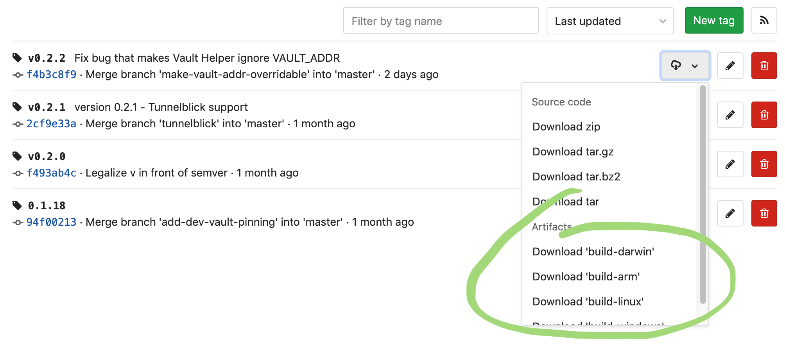

# Vault Helper


## Logging in

Permissions are managed via roles. The currently implemented roles are:

- devops - Provides access to all team resources, docker registry and VPN access
- datascience - Provides access same as devops in addition to datascience permissions for AWS
- dataplatform - Provides access to datascience in addition to more permissions in AWS
- security - Provides access to security tools in addition to more permissions in AWS
- sre - Provides access to all the above and access to approved-secrets

### Note on short lived credentials

By authenticating with the vault-helper for a given role, you receive a token.
You can only have one token at any given time.

Vault tokens expire after a set time, and anything issued via them
(eg. certificates) will expire as well. It is important to call
`vault-helper renew` at least once within this time (preferably more often) to
ensure your secrets do not expire.

## Download and Installation

Download the latest version for your platform [here](https://git.yolt.io/infra/vault-helper/tags) by clicking the download button next to the latest tag and choosing your platform under 'artifacts'.



Unzip this somewhere on your `PATH`.

As a windows user, make sure you have `OpenSSH` installed and create a keypair (using `ssh-keygen` with the default storage location).

## Authentication

As part of onboarding you should have access to some role, eg. the `devops` role.
After installation use:

`vault-helper login --role myrole`, enter the role you have access to below:

The currently implemented roles are:
- devops - Provides access to all team resources, docker registry and VPN access
- datascience - Provides access same as devops in addition to datascience permissions for AWS
- dataplatform - Provides access to datascience in addition to more permissions in AWS
- security - Provides access to security tools in addition to more permissions in AWS
- sre - Provides access to all the above and access to approved-secrets

You will be asked to login using your Yolt credentials.

Note: If you need access to a specific roles, request them by asking to join a group here:
https://account.activedirectory.windowsazure.com/r#/groups

### VPN

If you are authenticated, you can run `vault-helper openvpn --path=/path/to/config`
to get a VPN configuration you can use to connect to the AWS environment. This
certificate will have an expiration date of one week, but keep in mind that if
your token expires before then, the certificate will be revoked and no longer
work. In this case, you will need to authenticate again and run the `vault-helper renew`
command.

Note: you can also get vpn credentials by going to https://access.yolt.io 

### Kubernetes

To connect to a Kubernetes cluster, a client certificate/private key pair and a
CA certificate for the Kubernetes API server are needed. If you are
authenticated, Vault Helper can retrieve these for you, along with the necessary
Kubeconfig.

To retrieve credentials and update/create a Kubeconfig, you can run the
following: `vault-helper k8s --cluster=<cluster name>`. This will create or 
update the Kubeconfig in the default location. Optionally, you can write the 
configuration to a custom location by providing the `--path <target>` option. 
This will require you to pass the `--kubeconfig=<config file path>` option to
`kubectl`.

If you have multiple clusters configured in your Kubeconfig, it is possible to
switch between them by switching contexts. You can list the available contexts
using `kubectl config get-contexts`, and switch to a different one using
`kubectl config use-context <context name>`.

### AWS

Devops have readonly access to AWS both in console and in commandline tools.

To get AWS credentials for DTA environments you use:

`vault-helper aws --account <dta/prd account>`

That will populate `~/.aws/credentials` with a "profile" called yolt-someaccount.
You also get a link that you can click for console access.

An example to get production access and use it in commandline tools

Get access: `vault-helper aws --account app-prd`
Use access to list all s3 buckets: `AWS_PROFILE=yolt-app-prd aws s3 list-buckets`
Or use `export AWS_PROFILE=yolt-app-prd`

SRE/Security can use `-rw` flag to get read-write credentials

### RDS (Postgresql)

Devops have access to databases in teams/acceptance environments.

For team environments there is only one shared rds for all databases (instance = `rds`)
For app-acc some databases have dedicated instances. Specify the specific instance if 
you need access there.

Use `vault-helper rds --env app-acc [--instance specificinstance] [-rw]` 

By default `--instance` is set to `rds` for convenience.

Add the `-rw` flag if you need read/write credentials! The default behavior has changed to readonly credentials
since v0.7.0

### SSH

After authentication, you can obtain an SSH client certificate by running `vault-helper ssh -env team5`.
The certificate expires after 24 hours.
With an SSH certificate you can remotely log into all servers (after connection to VPN). 
The recommended way is to configure your SSH for each environment in ~/.ssh/config:

```
Host *.team5
  IdentityFile /home/user/.ssh/id_rsa
  CertificateFile /home/user/.ssh/id_rsa_team5.pub
  User core
  Hostname %h.yolt.io
```

Then, you can login with just `ssh kafka.team5` or `ssh cassa@team5`.

## Renewing
Since version 0.0.1, vault-helper keeps track of all certificates it creates.
If you run `vault-helper renew`, it will renew the token and any certificates
that will expire in the next two hours. We recommend you run this command
regularly.

## Advanced

### Custom Token Helper

To use a custom token helper to switch between different Vault servers using the `vault` command, put this in $HOME/.vault

```sh
token_helper = "/home/user/.vault-helper/token-helper.sh"
```

And copy the token-helper.sh somewhere approriate to your system settings. 
The script is just an example and chooses the paths based on `VAULT_ADDR` and the token helper integrated with `vault-helper`.


